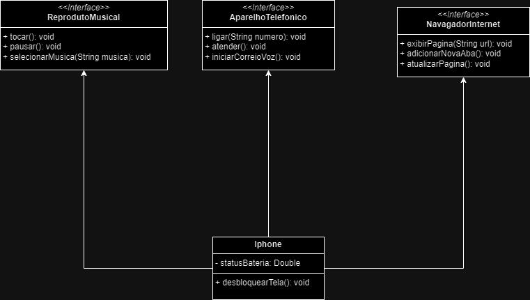

# Desafio prototipagem UML

## Diagrama de classes

No diagrama abaixo temos uma modelagem básica de como deve se comportar um Iphone. O Iphone foi apresentado ao mundo com 
o comportamento de algumas invenções existentes na época. Tais como um reprodutor musical, um aparelho telefonico e um navegador
de internet. A minha implementação ainda contém uma propriedade e um método para ser mais didática.

Esse repositório tem um exemplo de implementação em Java, mas poderia ser em outra linguagem que suporta OO.

Enjoy!
